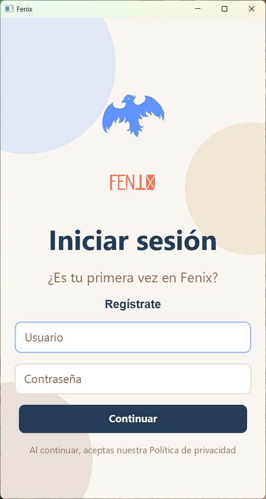
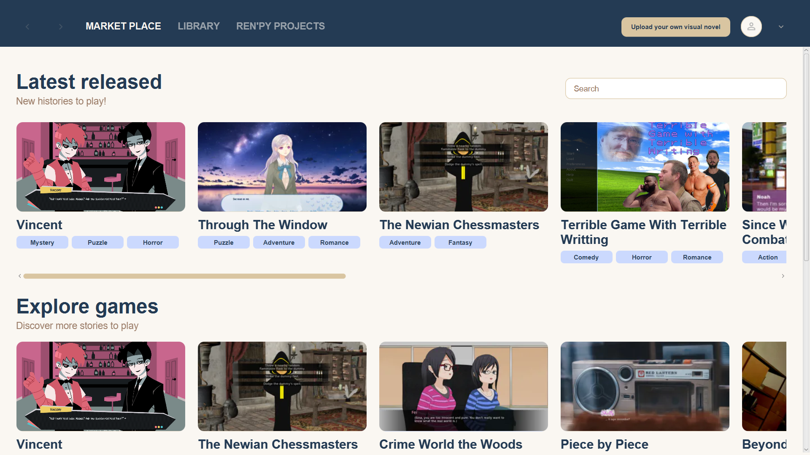
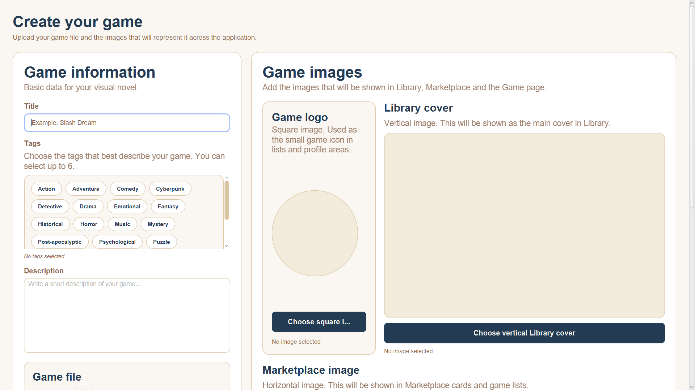
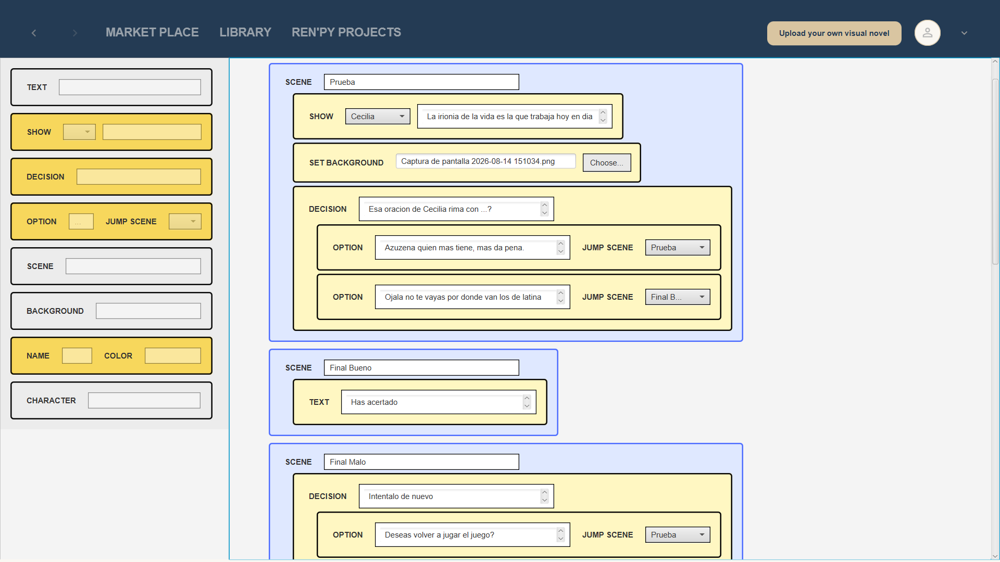
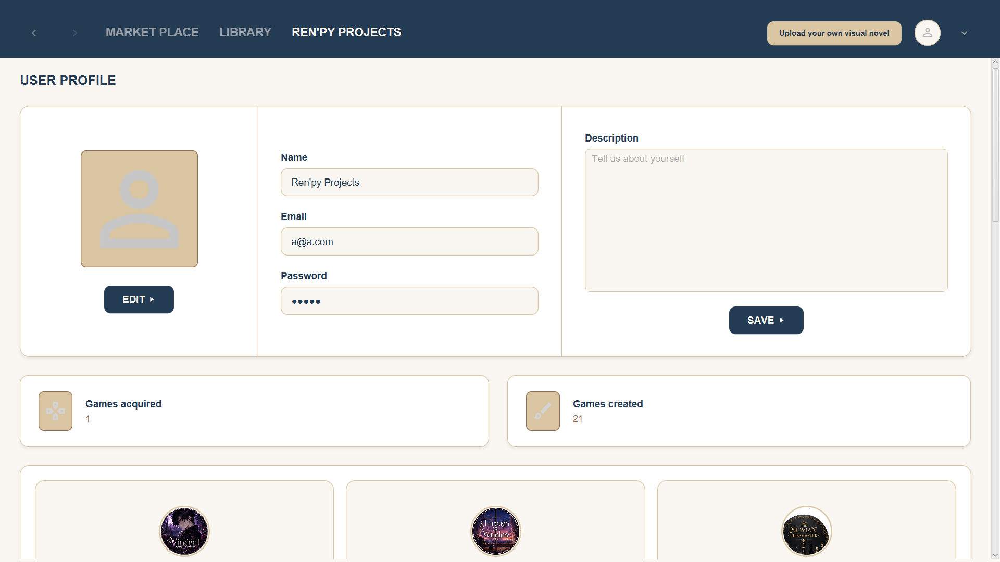
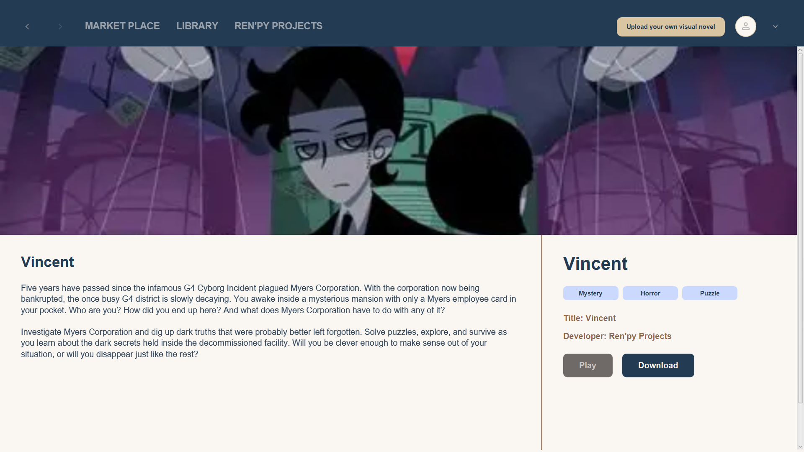

# 🦅 Proyecto Fénix

**Plataforma de creación y distribución de novelas visuales**

Proyecto Fénix es una aplicación modular desarrollada en **Java** que combina un **editor gráfico** para crear historias interactivas con un **marketplace** donde los usuarios pueden publicar, comprar y gestionar novelas visuales.

---

## 🚀 Descripción general

La versión actual prioriza una base funcional y mantenible centrada en:
- Autenticación de usuarios.
- Catálogo y compra de juegos.
- Biblioteca personal.
- Etiquetas, teasers y comunicación cliente-servidor.

El editor visual completo y la generación automática de proyectos Ren’Py se plantean como **trabajo futuro**.

---
## 🪞 Pantallas principales de la intefaz del cliente

| Login | Home |
|-----|--------|
|  |  |

| Upload | Create |
|-------|--------|
  | |

| Profile | Game |
|--------|--------|
|  |  | 

---

## 🧩 Arquitectura

El proyecto sigue una estructura **Maven multimódulo**:

| Módulo | Responsabilidad | Descripción |
|--------|-----------------|--------------|
| `common` | DTOs e interfaces compartidas | Define contratos y objetos de intercambio entre cliente y servidor. |
| `client` | Aplicación JavaFX | Gestiona la interfaz gráfica, navegación y comunicación con la API. |
| `server` | Backend Spring Boot | Expone endpoints REST, aplica lógica de negocio y gestiona persistencia con JPA. |
| `MySQL` | Base de datos | Almacena usuarios, juegos, etiquetas, compras, teasers y tokens. |

---

## 🧠 Tecnologías principales

| Tecnología | Uso |
|-------------|-----|
| Java 21 | Lenguaje principal |
| Maven | Gestión de dependencias y compilación |
| JavaFX | Interfaz gráfica del cliente |
| Spring Boot | Backend y API REST |
| Spring Data JPA | Acceso a datos |
| MySQL | Base de datos relacional |
| JUnit 5 | Framework de pruebas |
| Mockito | Mocks para pruebas unitarias |
| JaCoCo | Informe de cobertura |

---

## 🎯 Objetivos

### Objetivo general
Desarrollar una plataforma modular para crear, publicar y distribuir novelas visuales, con una base técnica sólida y ampliable.

### Objetivos específicos
- Arquitectura Maven multimódulo.
- Cliente JavaFX con marketplace, biblioteca y perfil.
- Backend Spring Boot con controladores, servicios y repositorios JPA.
- Base de datos MySQL con entidades relacionales.
- Sistema básico de autenticación con tokens.
- Pruebas automatizadas con JUnit 5, Mockito y JaCoCo.
- Documentación completa del ciclo de desarrollo.

---

## 🧪 Pruebas

La estrategia de pruebas se basa en **JUnit 5** y **Mockito**, con cobertura generada por **JaCoCo**.

| Tipo | Objetivo | Aplicación |
|------|-----------|------------|
| Caja negra | Validar entrada/salida de métodos públicos | Servicios y controladores |
| Caja blanca | Cubrir condicionales y excepciones | Servicios con reglas de negocio |
| DTOs | Verificar constructores y métodos | Módulo `common` |
| Cliente | Probar lógica independiente de UI | `SessionManager`, `FxmlView` |

**Cobertura JaCoCo (módulo server):** ~29 % global  
**Resultado:** `BUILD SUCCESS` en todos los módulos (`common`, `client`, `server`).

---

## 🧱 Base de datos

Diseñada en **MySQL** con entidades JPA:

| Tabla | Campos principales | Finalidad |
|--------|--------------------|------------|
| `client` | id, username, email, password, bio, profile_image_key | Usuarios registrados |
| `game` | id, title, description, price, dev_id, game_logo_key | Juegos publicados |
| `tag` | id, name, description | Etiquetas |
| `purchase` | id, client_id, game_id | Compras realizadas |
| `teaser` | id, game_id, object_key, type | Recursos promocionales |
| `auth_token` | id, token, client_id, expires_at | Tokens de sesión |

Los archivos e imágenes se almacenan en disco, referenciados por claves en la base de datos.

---

## 🔄 Metodología

Metodología **ágil** basada en iteraciones cortas:
- GitHub para control de versiones y seguimiento.
- Figma para prototipado visual.
- Maven para gestión modular y pruebas automatizadas.

---

## 📅 Planificación

| Fase | Bloque | Estado |
|------|---------|--------|
| 1 | Análisis inicial | ✅ Completado |
| 2 | Diseño de interfaz | ✅ Completado|
| 3 | Estructura modular | ✅ Completado |
| 4 | Backend y persistencia | ✅ Base completada |
| 5 | Cliente JavaFX | ✅ Completadol |
| 6 | Pruebas automatizadas | ✅ Implementadas |
| 7 | Documentación | ✅ Completado |

---

## 🔮 Trabajo futuro

- Editor visual completo para creación de novelas.
- Generación automática de proyectos Ren’Py.
- Publicación de juegos desde el cliente.
- Mejora de cobertura de pruebas y rendimiento.

---

## 👥 Equipo

- **Desarrolladores:** Jorge Alejandro Zagastizabal Vargas · David Arroyo Cano  
- **Tutor:** Mikel San Vicente Maeztu  
- **Centro:** IES Enrique Tierno Galván (Madrid)  
- **Curso:** 2025/2026  

---

## 📜 Licencia

Este proyecto se publica con fines educativos y puede reutilizarse bajo licencia **MIT**.

---

## 🧩 Repositorio

> [GitHub – ModuledFenix](https://github.com/Zv-Alejandro/ModuledFenix)

